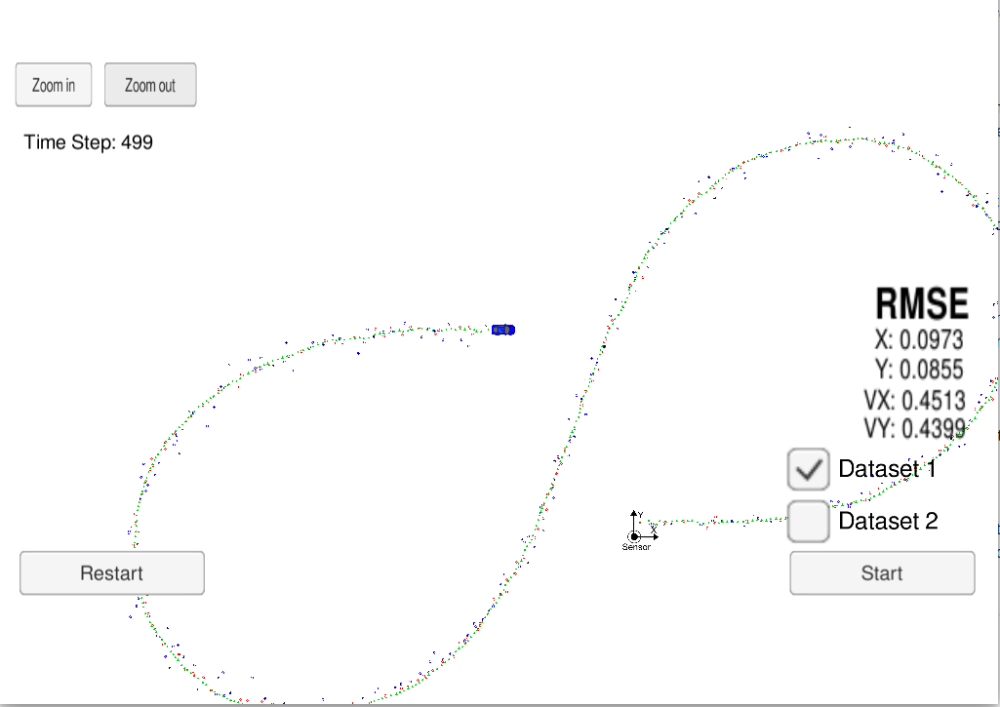

# Kalman filters



## Documentation
You can find all necessary information in documentation.pdf

## How to run 
Tested on Ubuntu 18.04

### Install all necessary dependencies
Download the [Simulator](https://github.com/udacity/self-driving-car-sim)

run `install_linux.sh`

Have different OS? Go [here](https://github.com/udacity/CarND-Extended-Kalman-Filter-Project).

### Run
cd to a folder with any Kalman filter(KF, for example), then run this commands:

```
cd KF
mkdir build
cd build
cmake ../
make
./KF
```

## References
Idea and parts of code are taken from [CarND-Extended-Kalman-Filter-Project](https://github.com/udacity/CarND-Extended-Kalman-Filter-Project) \
Simulator can be found here [self-driving-car-sim](https://github.com/udacity/self-driving-car-sim) \
Notation is taken from [Linear-Control-Slides-Spring-2020](https://github.com/SergeiSa/Linear-Control-Slides-Spring-2020) \
Written with [StackEdit](https://stackedit.io/)